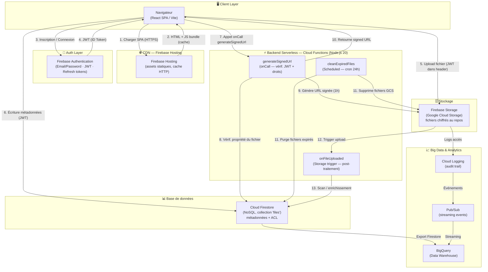

# SecureFileSharingApp — Architecture Cloud
> Sujet C — Application de partage sécurisé de fichiers  
> Stack : React · Firebase Auth · Cloud Firestore · Firebase Storage · Cloud Functions · Firebase Hosting

---

## PARTIE 1 — Architecture & Conception (rendu 20/05/2026)

---

### 1. Architecture Complète

#### 1.1 Schéma d'architecture (Mermaid)



#### 1.2 Description des flux principaux

| # | Flux | Acteur | Description |
|---|------|--------|-------------|
| 1-2 | Chargement SPA | Browser ↔ Firebase Hosting | L'utilisateur charge l'app React. Les assets JS/CSS sont servis depuis le CDN Firebase Hosting avec cache long (1 an, immutable pour les hashes Vite). |
| 3-4 | Authentification | Browser ↔ Firebase Auth | L'utilisateur se connecte. Firebase retourne un **ID Token JWT** (valide 1h) et un **Refresh Token**. |
| 5 | Upload fichier | Browser → Firebase Storage | Le SDK Firebase envoie le fichier directement vers GCS via `uploadBytesResumable` avec le JWT dans les headers. Les règles Storage vérifient l'identité. |
| 6 | Métadonnées | Browser → Firestore | Après upload, les métadonnées (nom, taille, chemin, expiration) sont écrites dans Firestore. Les règles garantissent que seul le propriétaire écrit. |
| 7-10 | Lien sécurisé | Browser ↔ Cloud Function | L'utilisateur demande un lien signé. La Cloud Function vérifie le JWT, contrôle la propriété dans Firestore, génère une URL signée GCS (TTL 1h), et incrémente le compteur d'accès. |
| 11 | Nettoyage | Cloud Scheduler → CF2 | Toutes les 24h, un job planifié supprime les fichiers dont `expiresAt < now()` dans Storage et Firestore. |
| 12-13 | Post-traitement | Storage trigger → CF3 | À chaque upload, une Cloud Function peut enrichir les métadonnées (taille réelle, hash, scan antivirus futur). |

---

### 2. Choix Techniques

| Composant | Service choisi | Justification |
|-----------|---------------|---------------|
| **Frontend** | React 19 + Vite + TypeScript | Écosystème riche, HMR rapide, typage fort. Vite produit des bundles optimisés avec hachage de contenu (cache-busting automatique). |
| **Authentification** | Firebase Authentication | Gestion native des JWT, refresh tokens automatiques, SDK client intégré. Évite d'implémenter toute la chaîne OAuth/JWT from scratch. Gratuit jusqu'à 10 000 utilisateurs/mois. |
| **Base de données** | Cloud Firestore | NoSQL schéma-flexible, requêtes temps réel, SDK client avec SDK offline. Idéal pour les métadonnées de fichiers (structure document). Règles de sécurité déclaratives. |
| **Stockage fichiers** | Firebase Storage (GCS) | Infrastructure GCS sous-jacente (durabilité 99.999999999%), upload/download direct depuis le client sans passer par un serveur intermédiaire. Chiffrement AES-256 au repos et TLS en transit. |
| **Backend serverless** | Firebase Cloud Functions (Node.js 20) | Pas de serveur à gérer, scaling automatique à 0. Idéal pour des opérations ponctuelles : génération de liens signés, nettoyage planifié. Intégration native Firebase Admin SDK. |
| **CDN / Hébergement** | Firebase Hosting | CDN mondial (200+ PoP), HTTPS automatique, déploiement atomique avec rollback instantané. Support des headers Cache-Control personnalisés. |
| **Analytics/Data** | BigQuery | Entrepôt de données colonnaire serverless, requêtes SQL sur des téraoctets, connecteur natif Firebase. Facturation à la requête. |

---

### 3. Scalabilité

#### 3.1 Composants qui scalent automatiquement

| Composant | Scalabilité | Mécanisme |
|-----------|-------------|-----------|
| **Firebase Hosting** | Horizontale illimitée | CDN distribué mondialement — pas de bottleneck serveur. Les assets statiques sont mis en cache sur les edge nodes. |
| **Firebase Storage** | Horizontale illimitée | Repose sur Google Cloud Storage, conçu pour des milliards d'objets et des TB/s de bande passante. |
| **Cloud Firestore** | Auto-sharding | Firestore distribue automatiquement les données sur plusieurs nœuds. Pas de configuration de partitionnement requise. Limite : ~1 write/s par document (utiliser des sous-collections pour contourner). |
| **Cloud Functions** | 0 → N instances | Scale to zero et scale to thousands en quelques secondes. Limite par défaut : 1 000 instances simultanées par région (augmentable). |
| **Firebase Auth** | Illimité (Google) | Géré entièrement par Google, aucune configuration de scaling requise. |

#### 3.2 Points de vigilance à forte charge

- **Hotspots Firestore** : si beaucoup d'utilisateurs accèdent au même document simultanément (ex. : un compteur global), utiliser `FieldValue.increment()` et les **transactions distribuées**.
- **Cold starts des Functions** : une instance froide ajoute ~300–800ms de latence. Utiliser `minInstances: 1` pour les fonctions critiques (trade-off coût/performance).
- **Bande passante Storage** : Firebase Storage ne throttle pas mais facture la bande passante. Mettre en place des quotas d'upload par utilisateur (taille max, nombre de fichiers).

---

### 4. Sécurité

#### 4.1 Règles Firestore

```javascript
// firestore.rules
rules_version = '2';
service cloud.firestore {
  match /databases/{database}/documents {

    // Collection 'files' : métadonnées des fichiers uploadés
    match /files/{fileId} {
      // Lecture : uniquement le propriétaire du fichier
      allow read: if request.auth != null
                  && resource.data.ownerId == request.auth.uid;

      // Création : utilisateur authentifié, propriétaire = lui-même
      allow create: if request.auth != null
                    && request.resource.data.ownerId == request.auth.uid
                    && request.resource.data.name is string
                    && request.resource.data.name.size() > 0
                    && request.resource.data.size is number
                    && request.resource.data.size > 0
                    && request.resource.data.size <= 104857600; // 100 MB max

      // Mise à jour : propriétaire uniquement, ownerId immuable
      allow update: if request.auth != null
                    && resource.data.ownerId == request.auth.uid
                    && request.resource.data.ownerId == resource.data.ownerId;

      // Suppression : propriétaire uniquement
      allow delete: if request.auth != null
                    && resource.data.ownerId == request.auth.uid;
    }
  }
}
```

**Principes appliqués :**
- **Least privilege** : chaque utilisateur ne voit que ses propres fichiers.
- **Immutabilité du propriétaire** : `ownerId` ne peut pas être modifié après création.
- **Validation des données** : taille et type vérifiés côté règles (defense-in-depth avec la validation Cloud Function).

#### 4.2 Règles Firebase Storage

```javascript
// storage.rules
rules_version = '2';
service firebase.storage {
  match /b/{bucket}/o {

    // Fichiers utilisateur : /files/{uid}/{filename}
    match /files/{uid}/{allPaths=**} {
      // Upload : utilisateur authentifié vers son propre dossier
      allow write: if request.auth != null
                   && request.auth.uid == uid
                   && request.resource.size <= 104857600       // 100 MB max
                   && request.resource.contentType.matches('(image|video|audio|application|text)/.*');

      // Lecture directe bloquée — passer par la Cloud Function (signed URL)
      allow read: if request.auth != null
                  && request.auth.uid == uid;
    }
  }
}
```

**Principes appliqués :**
- **Isolation par UID** : le chemin de stockage inclut l'UID (`files/{uid}/...`), impossible d'accéder aux fichiers d'un autre utilisateur.
- **Validation MIME** : seuls les types de fichiers courants sont autorisés.
- **Limite de taille** : 100 MB par fichier, imposée au niveau Storage (avant même la Cloud Function).
- **Liens signés** : les URL de téléchargement passent par la Cloud Function qui génère des signed URL GCS avec TTL court (1h), jamais exposées directement.

#### 4.3 Mécanisme d'authentification (Firebase Auth + JWT)

```
┌─────────────┐    1. Email/Password      ┌──────────────────┐
│   Browser   │ ─────────────────────────▶│ Firebase Auth    │
│  (React)    │ ◀─────────────────────────│ (Google IDP)     │
└─────────────┘    2. ID Token (JWT 1h)   └──────────────────┘
       │
       │  3. Toutes les requêtes incluent le JWT dans les headers
       ▼
┌─────────────────────────────────────────────┐
│  Firebase SDK (Storage / Firestore / Funcs) │
│  → Vérifie automatiquement le JWT           │
│  → Extrait request.auth.uid                 │
└─────────────────────────────────────────────┘
```

- **ID Token** : JWT signé par Google, contient `uid`, `email`, `exp`. Valide 1h.
- **Refresh Token** : stocké dans IndexedDB par le SDK Firebase, renouvelle automatiquement l'ID Token.
- **Vérification** : Firebase Admin SDK (dans les Cloud Functions) vérifie la signature du JWT sans appel réseau supplémentaire (clés publiques Google en cache).

#### 4.4 Validation dans les Cloud Functions

La Cloud Function `generateSignedUrl` applique 5 niveaux de validation :

1. **Authentification** : `request.auth` présent (Firebase vérifie le JWT automatiquement pour les `onCall`).
2. **Input sanitization** : `fileId` doit être une string non vide (protection injection).
3. **Existence** : le document Firestore doit exister.
4. **Autorisation** : `fileData.ownerId === request.auth.uid` (contrôle d'accès métier).
5. **Expiration** : `fileData.expiresAt < now()` → erreur `failed-precondition`.

---

### 5. Cache & CDN

#### 5.1 Firebase Hosting comme CDN

Firebase Hosting utilise le réseau CDN de Google (même infrastructure que Google Cloud CDN) avec des PoP (Points of Presence) répartis mondialement.

#### 5.2 Stratégie de cache par type de ressource

| Ressource | Cache-Control | Justification |
|-----------|---------------|---------------|
| `/assets/index-[hash].js` | `public, max-age=31536000, immutable` | Vite génère un hash de contenu unique → le fichier change = l'URL change. Cache 1 an sans revalidation. |
| `/assets/index-[hash].css` | `public, max-age=31536000, immutable` | Idem JS. |
| `/index.html` | `no-cache` | Point d'entrée de la SPA. Doit toujours être à jour pour pointer vers les bons hashes. |
| `/*.svg`, `/*.png` (publics) | `public, max-age=86400` | Assets statiques, cache 1 jour. |
| `/api/**` (Cloud Functions) | `no-store` | Données dynamiques, jamais cachées côté CDN. |

#### 5.3 Configuration Firebase Hosting (firebase.json)

```json
{
  "hosting": {
    "headers": [
      {
        "source": "/assets/**",
        "headers": [{"key": "Cache-Control", "value": "public, max-age=31536000, immutable"}]
      },
      {
        "source": "**/*.html",
        "headers": [{"key": "Cache-Control", "value": "no-cache"}]
      }
    ]
  }
}
```

#### 5.4 Ce qui NE peut PAS être mis en cache côté CDN

- **Métadonnées Firestore** : personnalisées par utilisateur, requièrent authentification.
- **Signed URLs** : générées dynamiquement avec TTL court, uniques par requête.
- **Tokens Firebase Auth** : secrets utilisateur, jamais mis en cache réseau.

---

## PARTIE 2 — Implémentation & Analyse (rendu 31/05/2026)

> Le code source complet se trouve dans les fichiers du projet. Cette section couvre les analyses complémentaires.

---

### 3. Analyse des Coûts Firebase

#### 3.1 Sources de coût principales (plan Blaze — pay-as-you-go)

| Service | Coût | Unité | Gratuit |
|---------|------|-------|---------|
| **Firestore reads** | $0.06 | par 100 000 lectures | 50 000/jour |
| **Firestore writes** | $0.18 | par 100 000 écritures | 20 000/jour |
| **Firestore deletes** | $0.02 | par 100 000 suppressions | 20 000/jour |
| **Storage stockage** | $0.026 | par GB/mois | 5 GB |
| **Storage téléchargements** | $0.12 | par GB sortant | 1 GB/jour |
| **Cloud Functions invocations** | $0.40 | par million d'appels | 2M/mois |
| **Cloud Functions compute** | $0.0000025 | par GB-seconde | 400 000 GB-s |
| **Firebase Hosting** | $0.15 | par GB stockage | 10 GB |
| **Firebase Hosting trafic** | $0.15 | par GB sortant | 360 MB/jour |

#### 3.2 Estimation pour un projet académique (faible usage)

| Scénario | Fichiers/jour | Lectures/jour | Coût mensuel estimé |
|----------|--------------|--------------|---------------------|
| Dev/test | ~10 uploads | ~50 | **$0** (quota gratuit) |
| 100 users actifs | ~200 uploads | ~5 000 | **~$2–5/mois** |
| 1 000 users actifs | ~2 000 uploads | ~50 000 | **~$20–40/mois** |

#### 3.3 Risques de dérive des coûts

- **Liens publics trop consultés** : un fichier populaire → milliers de lectures Firestore + téléchargements Storage. **Mitigation** : rate limiting dans la Cloud Function, cache côté client.
- **Writes non optimisés** : mettre à jour `accessCount` à chaque consultation → $0.18 × N. **Mitigation** : utiliser `FieldValue.increment()` (1 write atomique), regrouper les updates (batch writes).
- **Orphelins Storage** : fichiers supprimés de Firestore mais toujours dans GCS. **Mitigation** : la Cloud Function `cleanExpiredFiles` synchronise les deux.
- **Cold starts répétés** : si chaque invocation Function charge de gros modules Node. **Mitigation** : imports au niveau module (outside handler), `minInstances: 1` pour les fonctions critiques.

#### 3.4 Pistes d'optimisation

1. **Pagination Firestore** : `query(... limit(20), startAfter(lastDoc))` plutôt que `getDocs(collection)` entier.
2. **Cache client** : stocker les métadonnées en `sessionStorage` pour éviter les re-lectures Firestore.
3. **Signed URLs en cache** : si le TTL est 1h, stocker la signed URL côté client pendant sa durée de vie.
4. **Compression** : activer gzip/brotli sur Firebase Hosting (automatique) → réduction bande passante.
5. **Quotas utilisateur** : limiter à N fichiers et X MB par utilisateur via les règles Firestore.

---

### 4. Analyse Critique

#### 4.1 Limites de l'architecture

| Limite | Impact | Sévérité |
|--------|--------|----------|
| **Vendor lock-in Firebase/Google** | Migration très coûteuse (règles propriétaires, SDK spécifique, Firestore != SQL) | Élevée |
| **Cold starts Cloud Functions** | 300–800ms de latence à froid, visible pour l'utilisateur | Moyenne |
| **Firestore — 1 write/s par document** | Contournement nécessaire pour les compteurs globaux (sharding, FieldValue.increment) | Moyenne |
| **Absence de recherche full-text** | Firestore ne supporte pas LIKE ou full-text. Nécessite Algolia/Typesense en add-on. | Moyenne |
| **Pas de transactions inter-services** | Impossible d'avoir une transaction atomique Storage + Firestore. Le nettoyage peut laisser des orphelins. | Faible |
| **Tarification à l'usage imprévisible** | Une fuite de boucle ou un crawler peut générer des coûts imprévus | Faible (avec alertes) |

#### 4.2 Axes d'amélioration

1. **Abstraction de la couche service** : isoler les appels Firebase dans des repositories interchangeables → facilite la migration vers Supabase (PostgreSQL + Auth + Storage open-source) si nécessaire.
2. **Tests d'intégration avec l'émulateur Firebase** : `firebase emulators:start` permet de tester les règles Firestore/Storage localement sans coût.
3. **Monitoring & Alertes** : configurer Google Cloud Monitoring + alertes de budget Firebase pour détecter les dérives.
4. **Virus scanning** : intégrer Cloud DLP ou un service antivirus dans la Cloud Function `onFileUploaded` avant de rendre le fichier accessible.
5. **Partage multi-utilisateurs** : stocker dans Firestore une ACL (`sharedWith: [uid1, uid2]`) et adapter les règles pour permettre la lecture aux utilisateurs listés.

#### 4.3 Risques de dépendance cloud (lock-in Google/Firebase)

- **Lock-in fort** : Firestore, Firebase Auth, Firebase Hosting sont des services propriétaires sans standard ouvert.
- **Alternatives équivalentes** :
  - Firebase Auth → Auth0, Supabase Auth, Cognito
  - Firestore → MongoDB Atlas, Supabase (PostgreSQL)
  - Firebase Storage → AWS S3, Supabase Storage
  - Cloud Functions → AWS Lambda, Cloudflare Workers
- **Stratégie de mitigation** : architecture hexagonale — interfaces TypeScript définissent les contrats, les implémentations Firebase sont injectables et remplaçables.

---

### 5. Dimension Big Data

#### 5.1 Pipeline de données : Ingestion → Stockage → Traitement → Analyse

```
                    INGESTION
              ┌─────────────────┐
              │  Upload fichier │  (événement Storage)
              │  Auth event     │  (connexion utilisateur)
              │  API call       │  (demande signed URL)
              └────────┬────────┘
                       │
                    STOCKAGE
              ┌────────▼────────┐
              │ Firebase Storage│◄── Data Lake brut
              │   (fichiers)    │    (tous les objets,
              └────────┬────────┘     format natif)
              ┌────────▼────────┐
              │  Cloud Firestore│◄── Métadonnées structurées
              │  (métadonnées)  │    (opérationnel, temps réel)
              └────────┬────────┘
                       │
                   TRAITEMENT
          ┌────────────▼────────────┐
          │    Cloud Functions      │
          │  Batch : cleanExpired   │◄── Scheduled (24h)
          │  Stream : onUploaded    │◄── Event-driven (immédiat)
          │  On-demand : signedUrl  │◄── User-triggered
          └────────────┬────────────┘
                       │
                    ANALYSE
          ┌────────────▼────────────┐
          │         BigQuery        │◄── Data Warehouse
          │  - Tendances d'usage    │    (requêtes SQL)
          │  - Fichiers populaires  │
          │  - Comportements suspects│
          └─────────────────────────┘
```

#### 5.2 Traitements Batch vs Streaming

| Traitement | Type | Déclencheur | Description |
|-----------|------|-------------|-------------|
| Nettoyage des fichiers expirés | **Batch** | Cron 24h | `cleanExpiredFiles` parcourt tous les documents Firestore avec `expiresAt < now()` et les supprime en bulk. |
| Export vers BigQuery | **Batch** | Cron nocturne | Firestore Export → BigQuery via l'extension Firebase BigQuery ou `firestore-bigquery-export`. |
| Détection d'anomalies (taux d'accès) | **Streaming** | Chaque appel `generateSignedUrl` | Si `accessCount > seuil` en peu de temps → Pub/Sub → Cloud Function alerte → blocage du fichier. |
| Indexation des métadonnées | **Streaming** | Trigger `onDocumentCreated` | Enrichissement immédiat des métadonnées au moment de l'upload. |
| Rapport d'utilisation quotidien | **Batch** | Cron 7h du matin | Agrégation BigQuery → email récapitulatif via SendGrid. |

#### 5.3 Data Lake et Data Warehouse

**Firebase Storage comme Data Lake brut :**
- Tous les fichiers uploadés y sont stockés dans leur format natif.
- Aucune transformation au moment de l'ingestion.
- Durée de conservation configurable (lifecycle rules GCS).
- Accessible par n'importe quel outil GCP (Dataflow, Dataproc, BigQuery External Tables).

**BigQuery comme Data Warehouse :**
```sql
-- Exemple : top 10 fichiers les plus téléchargés ce mois
SELECT
  name,
  ownerId,
  accessCount,
  DATE(createdAt) AS uploadDate,
  ROUND(size / 1048576, 2) AS sizeMB
FROM `projet.firebase_export.files`
WHERE DATE(createdAt) >= DATE_TRUNC(CURRENT_DATE(), MONTH)
ORDER BY accessCount DESC
LIMIT 10;
```

#### 5.4 Architecture Lambda vs Kappa — Choix justifié

```
Architecture Lambda :
├── Batch Layer  (Firestore → BigQuery export nocturne)     → Vue historique complète
└── Speed Layer  (Cloud Functions streaming)                 → Vue temps réel approximative

Architecture Kappa :
└── Streaming Only (Pub/Sub → Dataflow → BigQuery)          → Un seul pipeline
```

**Choix recommandé pour ce cas d'usage : Architecture Lambda simplifiée**

**Justification :**
- Le volume de données est **modéré** (fichiers d'utilisateurs individuels, pas du Big Data à proprement parler au démarrage).
- Les deux besoins coexistent :
  - **Temps réel** : détection d'accès suspects, mise à jour du compteur d'accès → Cloud Functions (Speed Layer).
  - **Historique** : rapports d'usage, analyses de tendances → export BigQuery nocturne (Batch Layer).
- L'architecture Kappa (streaming pur avec Dataflow) serait **sur-dimensionnée** et plus coûteuse pour ce projet académique.
- Firebase + BigQuery offre un Lambda "serverless" sans infrastructure à gérer, ce qui correspond à la philosophie Firebase.

**Migration vers Kappa si le volume dépasse ~1M events/jour** : passer à Pub/Sub + Dataflow (Apache Beam) pour un pipeline unifié.

---

## Récapitulatif des fichiers importants

| Fichier | Rôle |
|---------|------|
| `src/firebase.ts` | Initialisation Firebase (Auth, Firestore, Storage, Functions) |
| `src/services/auth.ts` | Service d'authentification (register, login, logout) |
| `src/services/storage.ts` | Service d'upload fichier vers GCS |
| `src/services/firestore.ts` | CRUD métadonnées dans Firestore |
| `src/hooks/useAuth.ts` | Hook React — état d'authentification |
| `src/hooks/useFiles.ts` | Hook React — gestion des fichiers |
| `functions/src/index.ts` | Cloud Functions (generateSignedUrl, cleanExpiredFiles) |
| `firestore.rules` | Règles de sécurité Firestore |
| `storage.rules` | Règles de sécurité Firebase Storage |
| `firebase.json` | Configuration Firebase (Hosting, Functions, rules) |
| `.env.example` | Template des variables d'environnement Firebase |
